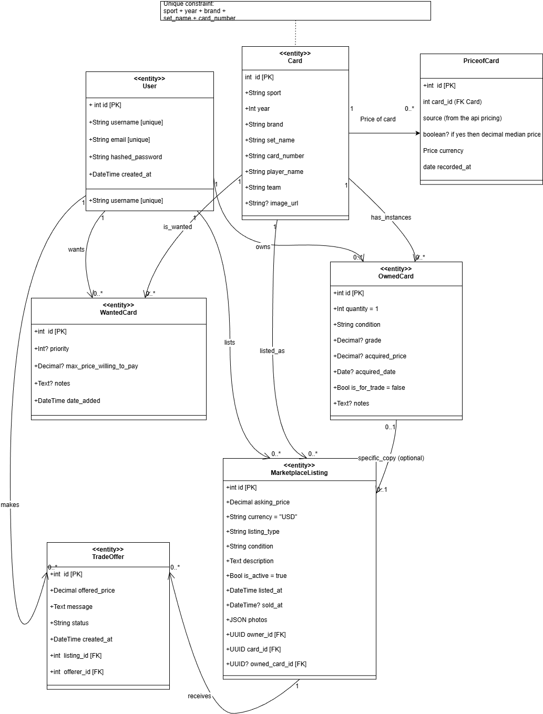

# Sports-Card-Checker

## What this repo will become

A web app where users catalogue sports trading cards (NHL / MLB / NBA) and fetch live eBay sold prices.  
_README will grow with the code; for now this file only gets you running._

---

## Dependencies:

    1. Install Node + npm (for React / Vite)
    2. Install Python ≥ 3.10

## 1. One-time local setup

### 1.1 Clone & root folder

```bash
1. git clone https://github.com/Dante-hu/Sports-Card-Checker.git

2. cd Sports-Card-Checker
```

## 2. Python Backend

```
1. python -m venv venv  #windows
2. venv/Scripts/activate
3. pip install -r requirements.txt
```

## 3. React Frontend

```bash
1. cd client
2. npm install
```

## 4. Docker

docker compose up --build


docker compose up

http://localhost:5000

localhost:5433(your port) 

## 5. Presentation
https://youtu.be/mesbA9erU6Y

## 6. System Architecture

### class diagrams


### package diagrams


## How to run locally
1. From the root project directory cd into the server folder in one terminal
```bash
    python -m flask --app app:create_app run --debug
```
2. From the root project directory cd into the client folder in another terminal
```bash
   npm run dev  
```

### Known problems:
1. If the project fails to connect to a postgresql db, make sure YOUR postgresql service is running locally, navigate to the server/app/__init__.py file and change the db url port number to match yours
2. If the project runs and no cards are generated, run the following command from the root directory in a new terminal
    ```bash
      python -m scripts.import_cards_from_output
    ```
3. If cards are generated and the project runs well, but /owned and /wanted pages throw 'authentication error', logout and re-sign in 


